# Especificações do Projeto

Pré-requisitos: <a href="1-Documentação de Contexto.md"> Documentação de Contexto</a>

Definição do problema e ideia de solução a partir da perspectiva do usuário. É composta pela definição do  diagrama de personas, histórias de usuários, requisitos funcionais e não funcionais além das restrições do projeto.

Apresente uma visão geral do que será abordado nesta parte do documento, enumerando as técnicas e/ou ferramentas utilizadas para realizar a especificações do projeto

## Personas

| Isabela Gomes                                                                                                                |                                       |                                  |
|------------------------------------------------------------------------------------------------------------------------------|---------------------------------------|----------------------------------|
||**Idade:** 25 anos   **Ocupação:** Estudante e estagiário de psicologia    **Faixa salarial:** 0,5 salários mínimos |**Aplicativos:** Instagram, Facebook, WhatsApp, TikTok e Outlook                                  |
|**Motivações:**   Se esforça muito nos estudo pois sonha em dar uma vida melhor para sua família. Quer ter uma velhice saudável e por isso já pensa no futuro.    | **Frustrações e Pontos de dor:**   -Tem pouco tempo para cuidar da saúde porque está com uma rotina muito cheia;   -Não consegue marcar consultas com médicos especialistas com tanta facilidade no SUS;   - Já marcou consultas online quando tinha convênio, e por isso busca por uma solução prática para marcar consultas;   -Não tem dinheiro para frequentar clínicas particulares.   | **Necessidades:**   Tem a necessidade de tirar um tempo para cuidar da saúde e por isso está em busca de meios práticos para marcar consultas e exames. | 

| Helena Rodrigues                                                                                                             |                                       |                                  |
|------------------------------------------------------------------------------------------------------------------------------|---------------------------------------|----------------------------------|
|      |**Idade:** 47 anos   **Ocupação:** Auxiliar administrativo    **Faixa salarial:** 1,5 salários mínimos |**Aplicativos:** WhatsApp e Outlook                                   |
|**Motivações:**   Apesar da rotina corrida Helena, ela precisa tirar um tempo para cuidar de sua saúde, para conseguir dar suporte aos seus pais idosos e para seus filhos.  | **Frustrações e Pontos de dor:**   -Precisa se deslocar várias vezes para marcar apenas uma consulta com um médico especialista;   -Tem uma rotina muito corrida, e isso acaba dificultado Helena a marcar consultas presencialmente;   -Não consegue marcar consultas por telefone ou online.   | **Necessidades:**   Precisa de meios mais práticos e rápidos para marcar suas consultas com médicos especialistas, de preferencia que não demande nenhum tipo de deslocamento.|

| Marta Koffman Hills                                                                                                          |                                       |                                  |
|------------------------------------------------------------------------------------------------------------------------------|---------------------------------------|----------------------------------|
|    |**Idade:** 70 anos   **Ocupação:** Empresária e Dona da clínica Medmulher    **Faixa salarial:** 50 salários mínimos |**Aplicativos:** Instagram, Facebook, WhatsApp e Outlook                                   |
|**Motivações:**   Quando mais nova, Marta era filha de um pai americano empresário milionário que veio morar no Brasil, e sua mãe era uma brasileira que tinha como profissão faxinar mansões. Ela seguiu os passos do pai, tornando-se empresária dos bens familiares, e criou uma clínica especializada para mulheres sem fins lucrativos para mulheres de baixa renda. | **Frustrações e Pontos de dor:**   -Devido ao grande número de mulheres procurando a clínica e à dedicação especial à sua administração, é imprescindível contar com um sistema que possa gerir o fluxo de pacientes sem a necessidade de criar fichas individuais para cada uma;   -A ausência de um agendamento eficaz dificulta o atendimento oportuno de várias mulheres em condições de saúde precárias.   | **Necessidades:**   É necessário implementar um sistema que possa registrar as pessoas e otimizar o agendamento, garantindo o acesso à especialidade necessária para cada paciente.|

| Cristina Mourão de Assis                                                                                                     |                                       |                                  |
|------------------------------------------------------------------------------------------------------------------------------|---------------------------------------|----------------------------------|
|     |**Idade:** 60 anos   **Ocupação:** Ginecologista aposentada e prestadora serviço clínica Medmulher    **Faixa salarial:** 4 salários mínimos |**Aplicativos:** Instagram, WhatsApp e Outlook                         |
|**Motivações:**   Depois de se aposentar, Cristina sentiu que sua vida estava muito parada e optou por continuar trabalhando. Ao conhecer Marta e o projeto da clínica Medmulher, decidiu empregar toda a sua experiência profissional.    | **Frustrações e Pontos de dor:**   -Devido à alta demanda de mulheres necessitando, é crucial ter um sistema que possa gerir melhor a sua agenda;   -Devido à falta de um sistema, os horários com as pacientes estão extremamente desorganizados, sendo determinados pela ordem de chegada das pessoas à clínica no dia.   | **Necessidades:**   É essencial dispor de um sistema que possibilite agendar e marcar horários, facilitando o dia a dia da profissional.|

## Histórias de Usuários

Com base na análise das personas forma identificadas as seguintes histórias de usuários:

|EU COMO... `PERSONA`| QUERO/PRECISO ... `FUNCIONALIDADE` |PARA ... `MOTIVO/VALOR`                 |
|--------------------|------------------------------------|----------------------------------------|
|Isabela Gomes  | Agendar consultas gratuitas com especialistas específicos  | Começar cedo a priorizar a própria saúde      |
|Helena Rodrigues  | Agendar consultas gratuitas com especialistas específicos      | Cuidar da sua saúde devido à rotina de vida agitada |
|Marta Koffman Hills  | Alterar, adicionar ou excluir agendamentos das pacientes   |  Manter o controle do número de pacientes  |
|Cristina Mourão de Assis      | Estabelecer um horário de agendamento com a paciente          | Gerenciamento do seu dia a dia |

## Modelagem do Processo de Negócio 

### Análise da Situação Atual

Como apresentado na introdução do projeto, atualmente o acesso a cuidados médicos de qualidade é uma necessidade fundamental, porém muitas mulheres de baixa renda enfrentam desafios significativos para obter assistência médica adequada, especialmente quando se trata de saúde feminina. Sendo assim, para ter acesso ao atendimento adequado as necessidades médicas, as mulheres precisam entrar em contato com as clínicas através de ligações, que muitas vezes podem apresentar linha ocupada ou mesmo não ter um retorno da ligação feita. Isso acaba causando desistência em marcação de atendimentos e até atraso para receitar diagnósticos importante para a paciente. 
Para realizar a análise da situação atual usamos como exemplo dois casos de clínicas/institutos da mulher onde o contato principal é feito via telefone, através dos links <https://www.feliciorocho.org.br/servicos/saude-da-mulher> e <https://www.ism.net.br/contato>.

### Descrição Geral da Proposta

Para desenvolvimento da nossa proposta utilizaremos a notação BPMN. Segundo M. Chinosi, A. Trombetta (2012), o processo de negócio (BP) é um conjunto de um ou mais procedimentos ligados ou atividades executadas seguindo uma ordem predefinida que coletivamente realizam uma meta, normalmente dentro do contexto de uma estrutura organizacional que define funções ou relacionamentos funcionais. Um processo pode estar inteiramente contido em uma única unidade organizacional, bem como pode abranger várias organizações diferentes. Nosso projeto tem como objetivo criar uma aplicação móvel e web que permita que pacientes possam realizar o agendamento de seus cuidados médicos, gerenciamento e ativação de alertas sem que precisem comparecer pessoalmente ou fazer a ligação para a clínica da mulher,e para isso desenvolvemos um processo AS-IS e um processo TO-BE.

### Processo 1 – PROCESSO AS-IS

Esse processo tem como característica apresentar o modelo atual de agendamento de horário para atendimento em clínicas da mulher, onde o cliente precisa entrar em contato via telefone para fazer o agendamento.

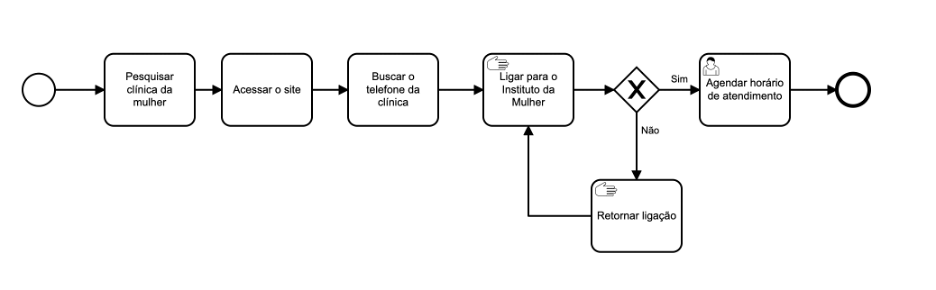

### Processo 2 – PROCESSO TO-BE

Esse processo tem como característica apresentar o modelo futuro de agendamento em clínica da mulher, onde o cliente pode realizar seu agendamento, gerenciamento e receber alerta de suas consultas de maneira online através do aplicativo desenvolvido.

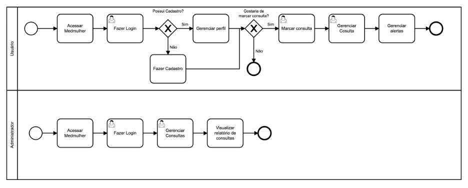

M. Chinosi, A. Trombetta. BPMN: An introduction to the standard. Computer Standards & Interfaces 34 (2012) 124–134

## Indicadores de Desempenho

Os indicadores de desempenho serão apresentados abaixo, considerando as possibilidades de avaliação através das informações do diagrama de classes.

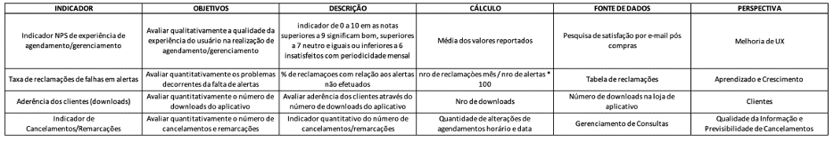

## Requisitos

A tabela a seguir apresenta os requisitos funcionais do projeto, identificando suas respectivas prioridades de entrega.

### Requisitos Funcionais

|ID    | Descrição do Requisito  | Prioridade |
|------|-----------------------------------------|----|
|RF-001| Permitir que o usuário faça seu cadastro no sistema | ALTA | 
|RF-002| Permitir que o usuário faça login e logout no sistema | ALTA |
|RF-003| Permitir que o usuário gerencie o seu perfil cadastrado | MÉDIA |
|RF-004| Permitir que o usuário marque consultas com o médico especialista de sua necessidade | ALTA | 
|RF-005| Permitir que o usuário consulte datas e horários disponíveis para consultas | ALTA |
|RF-006| Permitir que o usuário cadastrado visualize, altere e/ou cancele a data e a hora da consulta marcada | MÉDIA | 
|RF-007| Alertar ao usuário quando a data da consulta estiver próxima | BAIXA |
|RF-008| Permitir que o administrador do sistema cadastre datas, horários de consultas e médicos | ALTA | 
|RF-009| Permitir que o administrador do sistema visualize o relatório de consultas marcadas | ALTA | 

### Requisitos não Funcionais

|ID     | Descrição do Requisito  |Prioridade |
|-------|-------------------------|----|
|RNF-001| O sistema deve ser responsivo do lado móvel e web | MÉDIA | 
|RNF-002| O sistema deve garantir a segurança dos dados dos usuários cadastrados |  ALTA | 
|RNF-003| O sistema deve ser intuitivo e de fácil utilização para os usuários |  BAIXA | 
|RNF-004| O sistema deve ser capaz de suportar um grande número de acessos simultâneos | MÉDIA | 
|RNF-005| O sistema deve estar disponível 24 horas por dia, 7 dias por semana, para que os usuários possam marcar consultas a qualquer momento |  ALTA | 
|RNF-006| O sistema deve ser confiável, sem apresentar falhas ou erros frequentes |  ALTA | 
|RNF-007| A aplicação deve ser compatível com os principais navegadores do mercado (Google Chrome, Firefox, Microsoft Edge) e sistemas operacionais para smarthphones e tablets (Android e iOS. |  ALTA | 
|RNF-008| A aplicação deve ser publicada em um ambiente acessível publicamente na Internet |  BAIXA | 

## Restrições

As questões que limitam a execução desse projeto e que se configuram como obrigações claras para o desenvolvimento do projeto em questão são apresentadas na tabela a seguir.

|ID|	Descrição|
|-------|----------------------------------------------------------------------------------------------|
|RE-01|	O projeto deverá ser entregue no final do semestre letivo, não podendo extrapolar a data de 10/12/2023.| 
|RE-02|	A aplicação deve conter uma WEB API que faça a aplicação web e mobile interagirem simultaneamente |
|RE-03|	A equipe não pode subcontratar o desenvolvimento do trabalho.|

## Diagrama de Casos de Uso

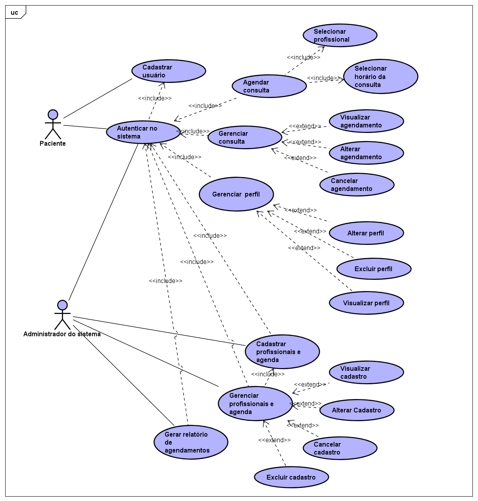

# Matriz de Rastreabilidade

A matriz de rastreabilidade é uma ferramenta usada para facilitar a visualização dos relacionamento entre requisitos e outros artefatos ou objetos, permitindo a rastreabilidade entre os requisitos e os objetivos de negócio. 

- Em "X" estão os requisitos funcionais e não funcionais que se adequam as queixas que os usuários aprensentam.
- O colorido mostra a relação vertical para trás ou frente e horizontal.

# Gerenciamento de Projeto

De acordo com o PMBoK v6 as dez áreas que constituem os pilares para gerenciar projetos, e que caracterizam a multidisciplinaridade envolvida, são: Integração, Escopo, Cronograma (Tempo), Custos, Qualidade, Recursos, Comunicações, Riscos, Aquisições, Partes Interessadas. Já o manifesto ágil é baseado nos seguintes valores indivíduos e interações mais que processos e ferramentas, software em funcionamento mais que documentação abrangente, colaboração com o cliente mais que negociação de contratos e responder a mudanças mais que seguir um plano. O nosso projeto de desenvolvimento de software tem o objetivo de atender aos requisitos tradicionais de projetos, não obstante dos valores do manifesto ágil e sua metodologias, para esse projeto propomos uma visão híbrida do uso dos casos.

## Gerenciamento de Tempo

Para realização do acompanhamento do gerenciamento de tempo, utilizaremos a visão de Roadmap do Github. Essa visão apresenta o projeto como em um gráfico de Gantt considerando as datas de início e fim planejadas do projeto. Através dessa visão é possível listar tudo que precisa ser feito para colocar o projeto em prática, dividir em atividades e estimar o tempo necessário para executá-las.

Abaixo o gráfico de acompanhamento tempo (Gantt).

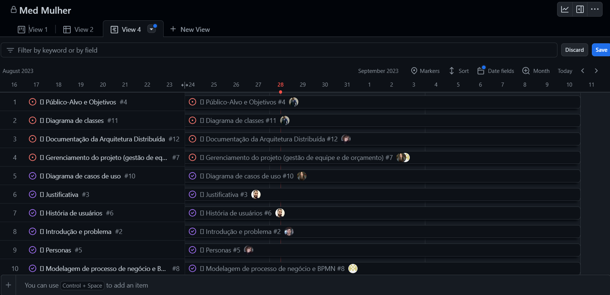

## Gerenciamento de Equipe

Para a organização dos trabalhos a equipe utilizou a metodologia do Ágil Kanban com o uso de quadro de tarefas da funcionalidade “Projects” existente na plataforma do Github. Foi efetuado no Github a criação de issues (tarefas / problemas), estes itens são atribuídos a pessoas, ao projeto e a qual milestone (neste caso entrega) pertencem. Com isso, é possível a elaboração da visualização do acompanhamento por meio de lista de problemas, board Kanban de tarefas e o acompanhamento de status por meio de taxa de finalização das milestones.

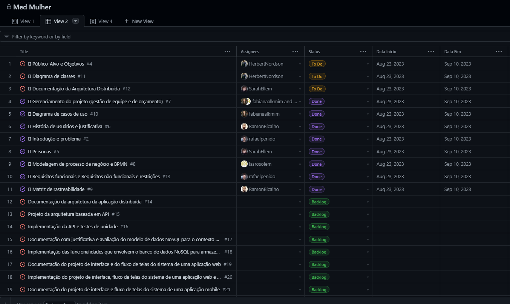

Para o gerenciamento, organização e distribuição das tarefas, as Sprints estão estruturadas no formato de marcos, conforme demonstrado abaixo:

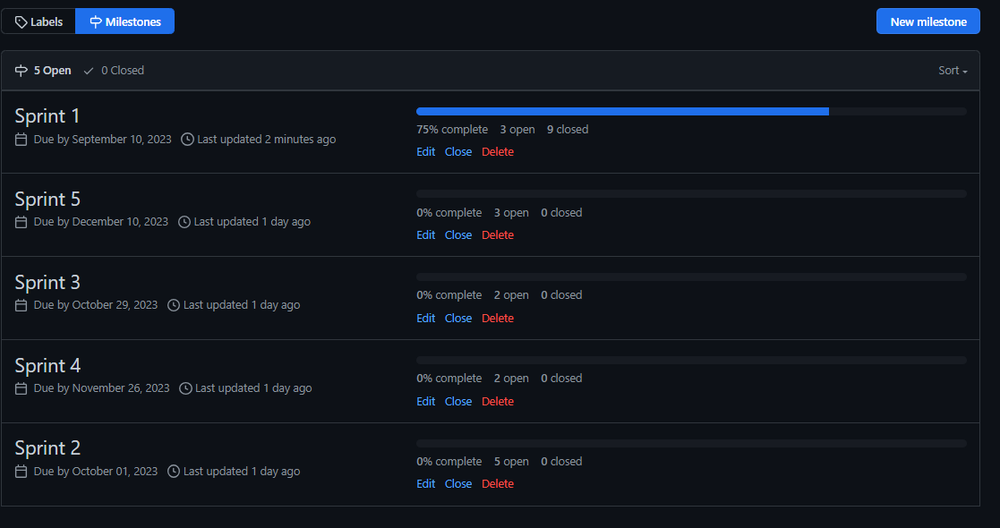

Os entregáveis estão dispostos no “Product Backlog” e apresentados em método Kanban conforme andamento da atividade:

Recursos: esta lista mantém um template de tarefas recorrentes com as configurações padronizadas que todos devem seguir. O objetivo é permitir a cópia destes templates para agilizar a criação de novos cartões.
Backlog: recebe as tarefas a serem trabalhadas e representa o Product Backlog. Todas as atividades identificadas no decorrer do projeto também devem ser incorporadas a esta lista.
To Do/Product Backlog: Esta lista representa o Sprint Backlog. Este é o Sprint atual que estamos trabalhando.
In Progress: Quando uma tarefa tiver sido iniciada, ela é movida para cá.
Test: Checagem de Qualidade. Quando as tarefas são concluídas, eles são movidas para o “CQ”. No final da semana, eu revejo essa lista para garantir que tudo saiu perfeito.
Locked: Quando alguma coisa impede a conclusão da tarefa, ela é movida para esta lista juntamente com um comentário sobre o que está travando a tarefa.
Done: nesta lista são colocadas as tarefas que passaram pelos testes e controle de qualidade e estão prontos para ser entregues ao usuário. Não há mais edições ou revisões necessárias, ele está agendado e pronto para a ação.

Abaixo, figura demonstrando a disposição dos entregáveis:

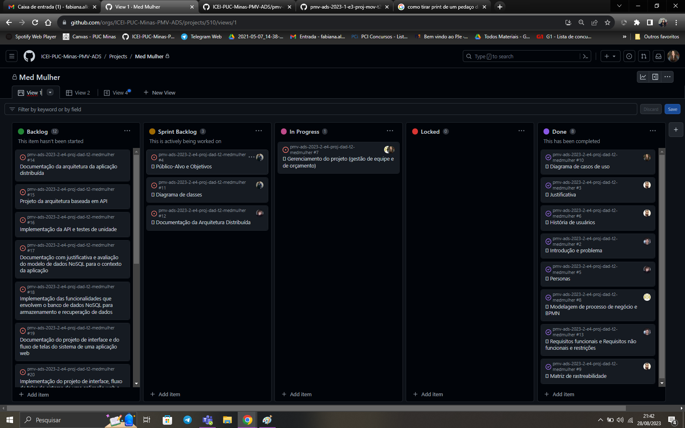

As tarefas são, ainda, etiquetadas em função da urgência da atividade e seguem o seguinte esquema de cores/categorias:

      - Vermelha: prioridade alta 
      - Amarela: prioridade média 
      - Verde: prioridade baixa 
      
Enquanto tiverem tarefas de maiores prioridades disponíveis, não poderão ser iniciadas as tarefas de menor prioridade, a prioridade padrão é a amarela, vermelhas as prioridades urgentes que surgirem ao longo do projeto e verdes as de baixa prioridade.

Abaixo, figura demonstrando a disposição das etiquetas:

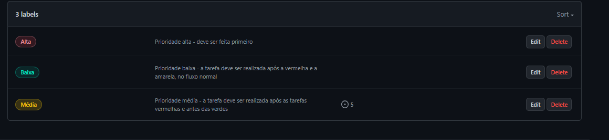

Como metodologia de trabalho foi optado pelo uso de métodos ágeis, sendo selecionado o Scrum para a organização do time. Devido à disponibilidade da equipe, foi definido o uso de reuniões semanais (weeklies), ao invés de diárias (dailies). A elaboração do backlog se dará como atividade a ser realizada após cada entrega por sprint. Ou seja, após a finalização da primeira sprint, a equipe irá se reunir para tratar quais são as novas prioridades e quem será responsável por sua execução.

Para acompanhamento do desenvolvimento do projeto e gerenciamento da equipe iremos utilizar as visões de gráficos do github, como os dashboard de capacidade. Essa visão tem como objetivo apresentar a capacidade da esteira de projetos e possíveis alocações nas sprints.

Abaixo o Dashboard para acompanhamento das atividades nas sprints:

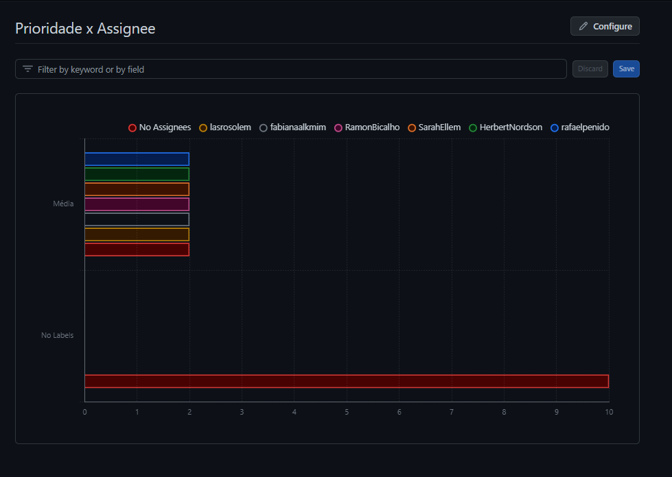

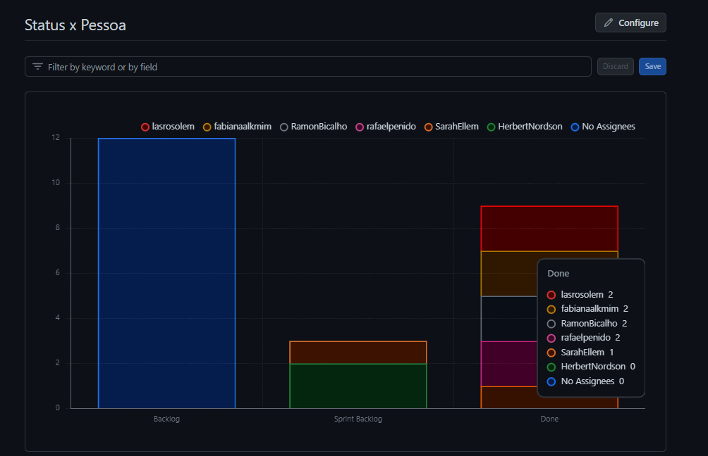

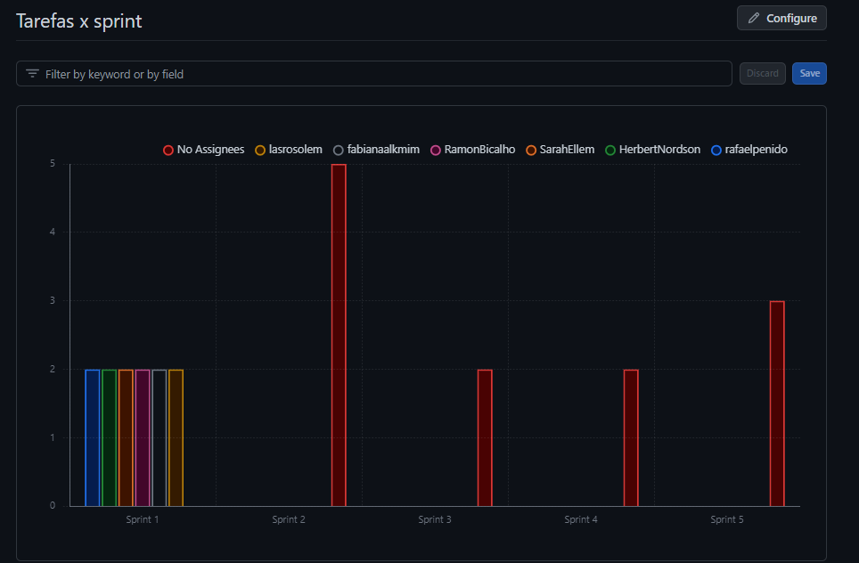

## Gestão de Orçamento

Para definição da gestão de orçamento foi necessário definir papéis e responsabilidades da equipe composta por Scrum Master, Product Owner (PO) e Desenvolvedores. Consideramos que a equipe possui 1 Scrum Master, 1 PO e 4 Desenvolvedores.

O objetivo do gerenciamento de custos é realizar um estimativa dos possíveis custos a serem dispendidos no desenvolvimento da solução de acordo com os requisitos mapeados. Como se trata de um desenvolvimento iterativo para o gerenciamento de custos, esta sendo considerado a estimativa de horas de projeto a serem alocadas por pessoa, com relação ao custo de homem-hora, além de considerar custos fixos com equipamentos para o desenvolvimento das atividades.

Para a estimativa de custos foi considerado o prazo de 141 dias úteis para a execução do projeto. Com uma equipe de 6 pessoas, composta por um Scrum Master, um PO e 4 desenvolvedores. O Scrum master atua em 4 projetos concomitantes. O PO atua em dois projetos, atuando em metade do período de desenvolvimento. Os desenvolvedores trabalham em tempo integral.

Tabela de salários:

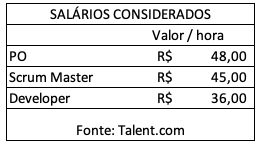

Tabela 1 – Salários-hora considerados

Estimativa de Custos:

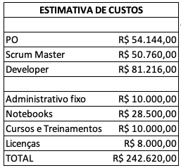

Tabela 2 – Custos totais estimados
