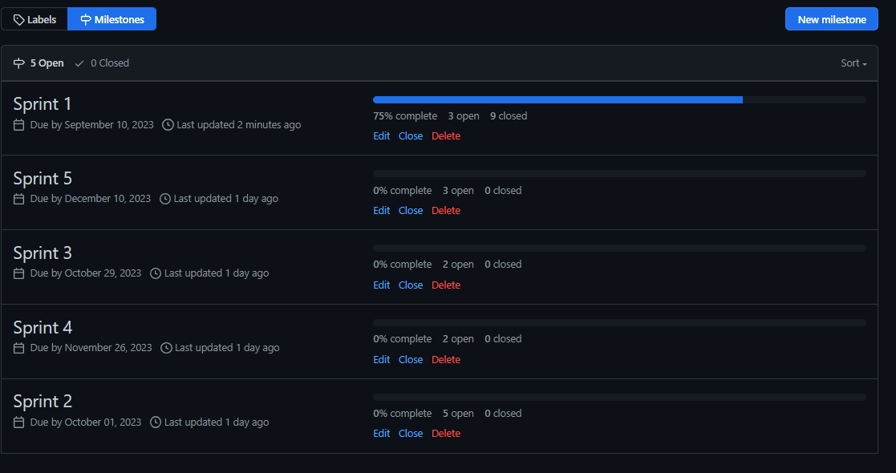

# Metodologia

A metodologia de trabalho do grupo para abordar o problema de desenvolvimento do projeto envolve uma série de elementos, incluindo ambientes de trabalho, gestão de código fonte e organização da equipe. Aqui está uma descrição desses elementos:

Ambientes de Trabalho:

Ambiente de Desenvolvimento: A equipe utiliza o Visual Studio Code como a principal IDE (Integrated Development Environment) para escrever, depurar e testar código. Ele oferece suporte a várias linguagens de programação e é altamente configurável.

Design de Interface: Para o design de interfaces de usuário e prototipagem, a equipe utiliza o Figma, uma ferramenta de design colaborativa baseada na web. Isso permite que os membros da equipe colaborem na criação e revisão de designs de forma eficiente.

Modelagem de Software: Para modelagem de software e criação de diagramas UML, a equipe utiliza o Astah, uma ferramenta de modelagem que ajuda a visualizar a arquitetura do sistema e os relacionamentos entre os componentes.

Controle de Versão: O GitHub é a plataforma escolhida para controle de versão e colaboração em código-fonte. A equipe utiliza o Git para gerenciar todas as alterações no código, permitindo rastreamento de versão, revisões de código e colaboração eficaz.

Comunicação: Para comunicação em equipe, o WhatsApp é usado como uma ferramenta de mensagens instantâneas para discussões rápidas e atualizações diárias.

Estrutura para Gestão do Código Fonte:

A gestão do código fonte é uma parte crítica do desenvolvimento do projeto. A equipe utiliza o GitHub para manter um repositório centralizado do código-fonte, que inclui recursos como:

Branches: A equipe trabalha com branches separados para desenvolver novos recursos ou correções de bugs. Isso permite que as alterações sejam desenvolvidas e testadas em ambientes isolados antes de serem incorporadas à versão principal (branch master).

Pull Requests: Para promover a colaboração e revisão de código, a equipe cria pull requests ao concluir uma tarefa. Isso permite que outros membros da equipe revisem o código, discutam alterações e garantam a qualidade antes de mesclá-lo com o branch principal.

Issues e Milestones: As issues são usadas para rastrear tarefas, bugs e recursos específicos do projeto. Os milestones são usados para agrupar e planejar tarefas em marcos ou versões específicas do projeto.

Processo e Ferramentas de Gestão de Times:

A equipe utiliza uma abordagem ágil para gerenciar o projeto e priorizar tarefas. As ferramentas incluem:

Kanban Board: Um quadro Kanban digital é usado para visualizar o progresso das tarefas. Isso ajuda a equipe a acompanhar o fluxo de trabalho, identificar gargalos e priorizar tarefas.

Gantt: Um gráfico de Gantt é usado para criar um cronograma de projeto visual que mostra as datas de início e conclusão das tarefas. Isso auxilia na programação e no gerenciamento de prazos.

WhatsApp: Além de comunicação diária, o WhatsApp também pode ser usado para manter os membros da equipe atualizados sobre mudanças urgentes ou atualizações críticas do projeto.

A combinação dessas ferramentas e práticas permite que a equipe colabore eficazmente, gerencie o desenvolvimento de software de forma eficiente e mantenha um alto nível de organização ao enfrentar o problema do projeto de desenvolvimento. Isso ajuda a garantir que o projeto progrida de maneira eficaz e atenda aos objetivos e prazos estabelecidos.
## Relação de Ambientes de Trabalho

Na tabela abaixo está representada as plataformas onde foram desevolvidos os artefatos durante o projeto, e seus respectivos links para acessá-los:

Ambiente   | Plataforma 
:--------- | :------:
Repositório de código fonte | [GitHub](https://github.com/ICEI-PUC-Minas-PMV-ADS/pmv-ads-2023-2-e4-proj-dad-t2-medmulher)
Projeto de Interface e Wireframes | [Figma](https://www.figma.com/files/project/84942157/Projeto-MedMulher?fuid=1012033669412074266) 
Gerenciamento do Projeto | [Kanban do Github](https://github.com/orgs/ICEI-PUC-Minas-PMV-ADS/projects/510)
Ambiente de desenvolvimento integrado (IDE) | [Visual Studio Code](https://code.visualstudio.com/docs) 
Tecnologias para comunicação | [Teams](https://teams.microsoft.com/_#/school/conversations/Geral?threadId=19:LalckUyFc6HlgnKcRQrdHL5O64qQNmAdV5lP8mI4UsI1@thread.tacv2&ctx=channel) e [Whatsapp](https://chat.whatsapp.com/Gcen8ZvFSGx4VDSSAWxeXM)

## Controle de Versão

A ferramenta de controle de versão adotada no projeto foi o
[Git](https://git-scm.com/), sendo que o [Github](https://github.com)
foi utilizado para hospedagem do repositório.

O projeto segue a seguinte convenção para o nome de branches:

- `main`: versão estável já testada do software
- `unstable`: versão já testada do software, porém instável
- `testing`: versão em testes do software
- `dev`: versão de desenvolvimento do software

Quanto à gerência de issues, o projeto adota a seguinte convenção para
etiquetas:

- `documentation`: melhorias ou acréscimos à documentação
- `bug`: uma funcionalidade encontra-se com problemas
- `enhancement`: uma funcionalidade precisa ser melhorada
- `feature`: uma nova funcionalidade precisa ser introduzida

## Gerenciamento de Projeto

### Divisão de Papéis

O gerenciamento e organização do projeto se baseia na metodologia ágil Scrum, que prioriza a entrega de valor e o proporcionamento de uma maior adaptabilidade da equipe. Isso ocorre em função da facilidade desse método em lidar com imprevistos e mudanças no planejamento ao longo do percurso. A partir dessa metodologia, a equipe está organizada da seguinte maneira:

- **Scrum Master**: Fabiana Alkmim Avelar
- **Product Owner**: Ramon Bicalho Cruz Magalhães 
- **Equipe de Desenvolvimento**:
     - Herbert Nordson Silva dos Santos 
     - Rafael Penido de Souza
     - Letícia Alves dos Santos Rosolem
     - Ramon Bicalho Cruz Magalhães
     - Fabiana Alkmim Avelar
     - Sarah Ellem
- **Equipe de Design**:
     - Sarah Ellem

### Processo

Como abordado na Especificação do Projeto, o nosso projeto de desenvolvimento de software tem o objetivo de atender aos requisitos tradicionais de projetos, não obstante dos valores do manifesto ágil e sua metodologias, para esse projeto propomos uma visão híbrida do uso dos casos.

Para o gerenciamento, organização e distribuição das tarefas, a equipe utilizou a metodologia do Ágil Kanban com o uso de quadro de tarefas da funcionalidade “Projects” existente na plataforma do Github, onde as Sprints estão estruturadas no formato de marcos, conforme demonstrado abaixo:

Abaixo, figura demonstrando a disposição dos entregáveis no quadro Kanban, presente em Projects na plataforma do Github:

### Ferramentas

As ferramentas empregadas no projeto são:

 Função |Ferramentas|Justificativa|
|--------|----------|--------------|
|Repositório de código fonte e documentação|GitHub|A ferramenta foi escolhida pois em cada eixo é disponibilizado aos alunos um repositório com o modelo dos tópicos e da documentação do curso, bem como uma integração robusta com boards de acompanhamento de projetos, facilitando a gestão de processos|
|Gerenciamento do Projeto|GitHub Projects|O Projects auxilia na integração de tarefas atribuídas à sua execução em commits|
|Editor de código |Visual Studio Code| Foi escolhido por sua integração com o sistema de versão, bem como extensões que agilizam o desenvolvimento de uma aplicação |
|Projeto de Interface e  Wireframes|Figma|A ferramenta foi escolhida por ser uma plataforma colaborativa completa para construção de design de interfaces e protótipos que agiliza o desenvolvimento visual de um projeto| 
|Comunicação e Reuniões|Microsoft Teams e Whats App|Foram ferramentas escolhidas pela conveniência e praticidade: contato com o professor e demais membros e acesso frequente diário, nessa ordem|

