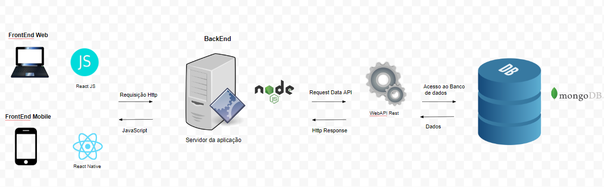

# Arquitetura da Solução

A arquitetura da nossa aplicação seguirá o estilo arquitetural baseado em serviços, onde teremos três componentes básicos: a interface do usuário, os serviços e o banco de dados.

O front-end da aplicação web será desenvolvido com CSS, React e JavaScript, enquanto a aplicação mobile será desenvolvida usando React Native. Ambas compartilharão um único back-end, que será desenvolvido em Node.js, e utilizarão três bancos de dados construídos no MongoDB.


## Diagrama de Classes

No diagrama de classes do projeto MedMulher, este seguirá a estrutura da arquitetura cliente-servidor, na qual o servidor fornece serviços aos clientes por meio da marcação de consultas. Essas consultas podem ser realizadas tanto pelo aplicativo móvel quanto pelo aplicativo desktop, contanto que estejam conectados à Internet. A seguir, encontram-se os diagramas Web e Mobile, respectivamente.


## Documentação do Banco de Dados Não Relacional

### Esquema Chave-Valor
```
{
    "address": {
        "street": "Rua Sapucaí",
        "district": "MG",
        "city": "Belo Horizonte",
        "complement": "lado A",
        "number": 2023,
        "postal_code": "30380-30"
    },
    "_id": "650b9a36099fd9f53e17fc6e",
    "name": "Helena Rodrigues",
    "password": "puc@minasvirtual",
    "email": "helenarodrigues07@gmail.com",
    "cpf": "022.123.412-55",
    "created_date": "2023-09-21T01:19:50.701Z",
    "update_user_date": "2023-09-21T01:20:22.34IZ"
}

{
    "_id": "980a9b36099jd9j53e17fc7f",
    "name": "Cristina Mourão de Assis",
    "specialty": "Ginecologista",
    "consultation_date": "10/12/2023"
    "created_date": "2023-09-21T01:19:51.701Z",
    "update_user_date": "2023-09-21T01:20:22.34IZ"
}

{
    "_id": "210c9d36099gd9g53e17fc8g",
    "name": "Cristina Mourão de Assis",
    "specialty": "Ginecologista",
    "health_status": "Mediano",
    "symptoms": "Cólica menstrual",
    "observation": "Menstruação intensa",
    "consultation_date": "10/12/2023"
    "created_date": "2023-09-21T01:19:52.701Z",
    "update_user_date": "2023-09-21T01:20:22.34IZ"
}

{
    "_id": "430e9f36099fh9f53h17fc4h",
    "name": "Marta Koffman Hills"
    "created_date": "2023-09-21T01:19:53.701Z",
    "update_user_date": "2023-09-21T01:20:22.34IZ"
}
```

## Tecnologias Utilizadas

A linguagem de programação JavaScript, atrelado a biblioteca React Native e React JS, juntamente com o framework e Node.js foram escolhidas para a aplicação porque a combinação dessas ferramentas e tecnologias permitem criar uma aplicação robusta e escalável, permitindo assim, lidar com um número crescente de clientes ou usuários

|  Linguagem   |      Aplicação      | 
|--------------|---------------------|
| Node.js	   |  WebAPI Rest        | 
| Mongo DB     |  Banco de Dados     | 
| VSCode       |  Software de Código | 
| Node.js	   |  BackEnd            | 
| React JS     |  FrontEnd WEB       | 
| React Native |  FrontEnd Mobile    | 



## Documentação da Implementação da WEB API Rest

Na tabela abaixo, identificamos as rotas (ROUTES) criadas na API Node.JS para interagir com o banco de dados do MongoDB, com o objetivo de realizar as operações de CRUD.

|  OPERAÇÃO    |      ROUTES     | 
|--------------|-----------------|
| CREATE	   |  POST           | 
| READ         |  GET            | 
| UPDATE       |  PATCH          | 
| DELETE	   |  DELETE         | 


- CREATE: Criando Usuáio

  
  
- READ: Visulizar Usuário

  
  
- UPDATE: Alterar Usuário

  
  
- DELETE: Deletar Usuário


## Hospedagem

Explique como a hospedagem e o lançamento da plataforma foi feita.

> **Links Úteis**:
>
> - [Website com GitHub Pages](https://pages.github.com/)
> - [Programação colaborativa com Repl.it](https://repl.it/)
> - [Getting Started with Heroku](https://devcenter.heroku.com/start)
> - [Publicando Seu Site No Heroku](http://pythonclub.com.br/publicando-seu-hello-world-no-heroku.html)

## Qualidade de Software

Conceituar qualidade de fato é uma tarefa complexa, mas ela pode ser vista como um método gerencial que através de procedimentos disseminados por toda a organização, busca garantir um produto final que satisfaça às expectativas dos stakeholders.

No contexto de desenvolvimento de software, qualidade pode ser entendida como um conjunto de características a serem satisfeitas, de modo que o produto de software atenda às necessidades de seus usuários. Entretanto, tal nível de satisfação nem sempre é alcançado de forma espontânea, devendo ser continuamente construído. Assim, a qualidade do produto depende fortemente do seu respectivo processo de desenvolvimento.

A norma internacional ISO/IEC 25010, que é uma atualização da ISO/IEC 9126, define oito características e 30 subcaracterísticas de qualidade para produtos de software.
Com base nessas características e nas respectivas sub-características, identifique as sub-características que sua equipe utilizará como base para nortear o desenvolvimento do projeto de software considerando-se alguns aspectos simples de qualidade. Justifique as subcaracterísticas escolhidas pelo time e elenque as métricas que permitirão a equipe avaliar os objetos de interesse.

> **Links Úteis**:
>
> - [ISO/IEC 25010:2011 - Systems and software engineering — Systems and software Quality Requirements and Evaluation (SQuaRE) — System and software quality models](https://www.iso.org/standard/35733.html/)
> - [Análise sobre a ISO 9126 – NBR 13596](https://www.tiespecialistas.com.br/analise-sobre-iso-9126-nbr-13596/)
> - [Qualidade de Software - Engenharia de Software 29](https://www.devmedia.com.br/qualidade-de-software-engenharia-de-software-29/18209/)
